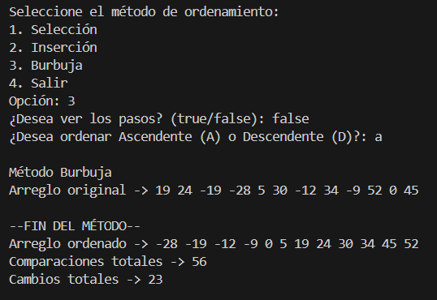
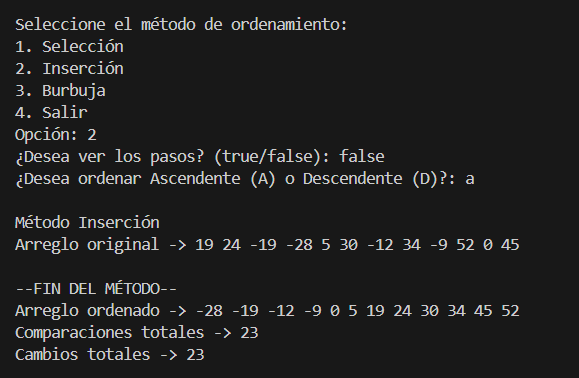
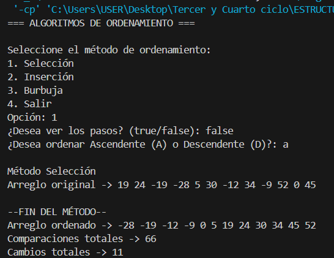

# 🧩 ESTRUCTURA DE DATOS

**Nombre del Estudiante:** Janelly Dayanna Chacha Vélez  
**Fecha:** Práctica 1 – 27 de Octubre

---

## 🧠 Métodos de Ordenamiento (Práctico)

### 🎯 Objetivo General
Estudiar el desempeño de los algoritmos de Selección, Inserción y Burbuja a través de su aplicación en Java.  
Comparar su rendimiento en función de la cantidad de cambios y comparaciones efectuadas durante la ejecución.

## 📝 Descripción General
En esta práctica se implementaron tres técnicas de ordenamiento en clases independientes:  
SortBubble, SortInsertion y SortSelection.

Cada método permite definir si el orden será ascendente o descendente, y activar una opción para mostrar los pasos intermedios del proceso.  
Al finalizar, cada uno devuelve el total de cambios y comparaciones, permitiendo evaluar su eficiencia.

## ⚙️ Métodos Explicados

### 🔹 1. Método Burbuja (SortBubble)

**Descripción:**  
El método Burbuja examina el arreglo comparando pares de elementos adyacentes.  
Si los elementos están en el orden incorrecto, se intercambian.  
La versión optimizada incluye una bandera (huboCambio) que detiene el proceso si no se realiza ningún intercambio durante una pasada completa, mejorando su rendimiento.

**Etapas del algoritmo:**
1. Se crea una copia del arreglo original para no modificarlo.  
2. Se recorren los elementos desde la posición 0 hasta el penúltimo.  
3. En cada iteración, se comparan elementos adyacentes.  
4. Si están en el orden incorrecto, se intercambian.  
5. Si no hay intercambios en una pasada, el algoritmo se detiene anticipadamente.  
6. Al finalizar, se imprime el arreglo ordenado y se muestran:
   - Comparaciones totales  
   - Cambios totales  

---

### 🔹 2. Método de Inserción (SortInsertion)

**Descripción:**  
El método Inserción simula el proceso de ordenar cartas en la mano.  
Toma cada elemento del arreglo y lo inserta en la posición correcta respecto a los elementos previos que ya están ordenados.

**Etapas del algoritmo:**
1. Se crea una copia del arreglo original para no alterar los datos.  
2. A partir del segundo elemento, se toma un valor de referencia (valor) y se compara con los anteriores.  
3. Si el valor es menor (en orden ascendente), los elementos mayores se desplazan a la derecha.  
4. Cuando se encuentra la posición correcta, se inserta el valor.  
5. Se cuentan los movimientos y comparaciones, mostrando los pasos si está activa la opción mostrarPasos.

---

### 🔹 3. Método de Selección (SortSelection)

**Descripción:**  
El algoritmo de Selección busca el elemento más pequeño (o más grande, según el orden) y lo coloca en la primera posición.  
Luego repite el proceso con los elementos restantes hasta que la lista esté completamente ordenada.

**Etapas del algoritmo:**
1. Se crea una copia del arreglo original.  
2. Para cada posición i, se busca el índice del valor mínimo o máximo dentro del subarreglo restante.  
3. Se intercambian los valores entre la posición actual y el índice encontrado.  
4. Se registran las comparaciones y los cambios realizados.  
5. El algoritmo finaliza cuando el arreglo está completamente ordenado.  

## 📊 Resultados Obtenidos

Con la ejecución de los tres algoritmos se logró:

- Comprender el proceso interno de cada método de ordenamiento.  
- Observar las diferencias en el número de comparaciones y cambios entre métodos.  
- Verificar que el método Burbuja mejorado reduce iteraciones innecesarias cuando el arreglo ya está ordenado.  
- Notar que el método de Inserción es el más eficiente para arreglos casi ordenados.  
- Determinar que el método de Selección realiza menos intercambios pero un mayor número de comparaciones.

## 🧭 Conclusiones

- La eficiencia de cada método varía según el tipo y tamaño del arreglo procesado.  
- Los algoritmos Burbuja, Inserción y Selección son ideales para comprender los principios fundamentales del ordenamiento, aunque no son los más eficientes para grandes volúmenes de datos.  
- En base a las pruebas realizadas, el método de Inserción resultó más eficiente que Burbuja y Selección en la mayoría de los casos, debido a su menor número de comparaciones y movimientos.
